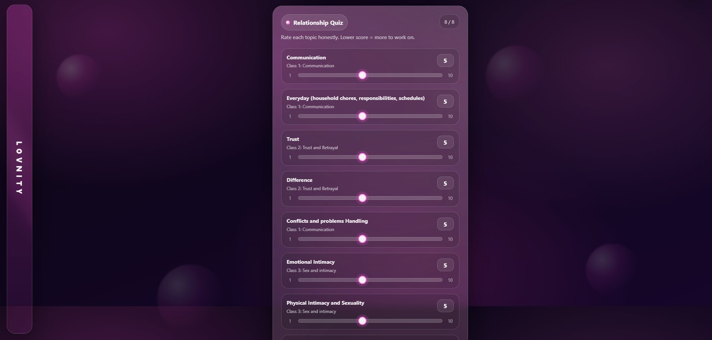
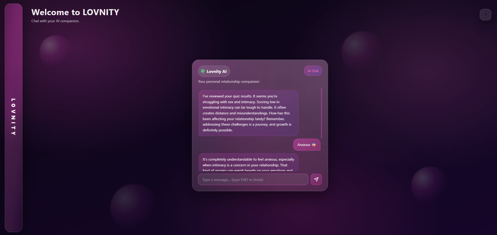
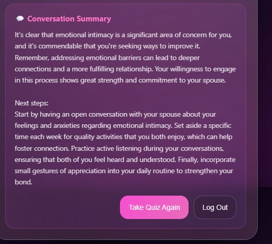

# Lovnity — AI Relationship Coach

> Capstone Project — Software and Systems Engineering  
> LUT University · Sprint ∞  
> Developed in collaboration with **Lovnity**

---

## Overview

Lovnity is a serverless AI-powered relationship coaching platform built as part of an industry collaboration with Lovnity. The platform guides users through a relationship health assessment and transitions them into a highly personalized coaching session powered by a large language model — with responses and strategy tailored directly to their results.

The project addresses a real-world need: accessible, stigma-free relationship support that combines structured self-assessment with intelligent, context-aware coaching.

---

## Screenshots

### Relationship Health Quiz


### AI Coaching Session


### Conversation Summary


---

## Key Features

**Relationship Health Quiz**  
An 8-question, slider-based assessment that scores relationship friction across three core dimensions: Communication, Trust, and Intimacy.

**Personalized AI Coach**  
Every coaching session opens with a greeting and strategy built from the user's specific quiz results — no generic responses.

**Dynamic Coaching Tracks**  
The AI automatically routes users into one of three coaching modes:

| Track | Focus |
|---|---|
| 🛋️ Bot Counselor | Emotional regulation and immediate support |
| 🌱 Self-Improvement | Personal growth and behavioral patterns |
| 🛠️ Relationship Action | Joint exercises and communication frameworks |

**Progress Tracking**  
Monitors user sentiment across an Action/Certainty matrix to surface insights about the user's psychological journey over time.

**Enterprise Partner Mode**  
Supports custom system prompts and clinical therapy referral triggers — designed for integration with healthcare partners.

**Safety System**  
Hardcoded crisis interception for self-harm and violence in both English and Finnish. PII is automatically scrubbed before any data reaches the LLM.

---

## Architecture

Lovnity is fully serverless — no dedicated backend server is required.

| Layer | Technology |
|---|---|
| Frontend | Vanilla HTML / CSS / JavaScript + Supabase JS Client |
| Backend | Supabase Edge Functions (Deno / TypeScript) |
| Database | Supabase (PostgreSQL) |
| AI | OpenAI API — `gpt-4o-mini` |

---

## Project Structure

```
lovnity-chatbot/
├── frontend/
│   ├── index.html        # Main UI — Login, Quiz, Chat
│   ├── app.js            # UI logic & Supabase client integration
│   ├── quizLogic.js      # Quiz scoring algorithm
│   └── styles.css        # Application styles
├── supabase/
│   └── functions/
│       └── chat-handler/
│           └── index.ts  # Edge Function: LLM routing, safety checks, coaching tracks
├── .gitignore
└── README.md
```

---

## Getting Started

### Prerequisites

- [Docker](https://www.docker.com/) — required for the local Supabase stack
- [Node.js](https://nodejs.org/)
- [Supabase CLI](https://supabase.com/docs/guides/cli)

### Environment Variables

Create a `.env` file inside `supabase/functions/`:

```env
OPENAI_API_KEY=your_openai_api_key
LLM_MODEL=gpt-4o-mini
SUPABASE_URL=your_local_or_live_supabase_url
SUPABASE_SERVICE_ROLE_KEY=your_service_role_key
```

### Start the Backend

```bash
# Initialize the local Supabase stack
npx supabase start

# Serve the Edge Function locally on port 54321
npx supabase functions serve chat-handler
```

### Start the Frontend

The frontend is entirely static. Open `frontend/index.html` with any local web server. If you use VS Code, install the **Live Server** extension, right-click `index.html`, and select **Open with Live Server**.

---

## Deployment

### Backend (Supabase Edge Function)

```bash
# Link your Supabase project
npx supabase link --project-ref your-project-id

# Set your production secrets
npx supabase secrets set OPENAI_API_KEY=your_key_here

# Deploy the Edge Function
npx supabase functions deploy chat-handler --no-verify-jwt
```

### Frontend (Static Hosting)

The `frontend/` folder contains only static assets and can be deployed to any static hosting provider such as Vercel, Netlify, or GitHub Pages.

Before deploying, ensure `supabaseUrl` and `supabaseAnonKey` in `frontend/app.js` point to your live Supabase project.

---

## Academic Context

This project was developed as a Capstone Project for the Software and Systems Engineering programme at **LUT University**, in collaboration with **Lovnity** (Sprint ∞). The goal was to design, build, and deliver a production-ready AI application that solves a genuine business problem — combining academic rigor with real-world industry requirements.